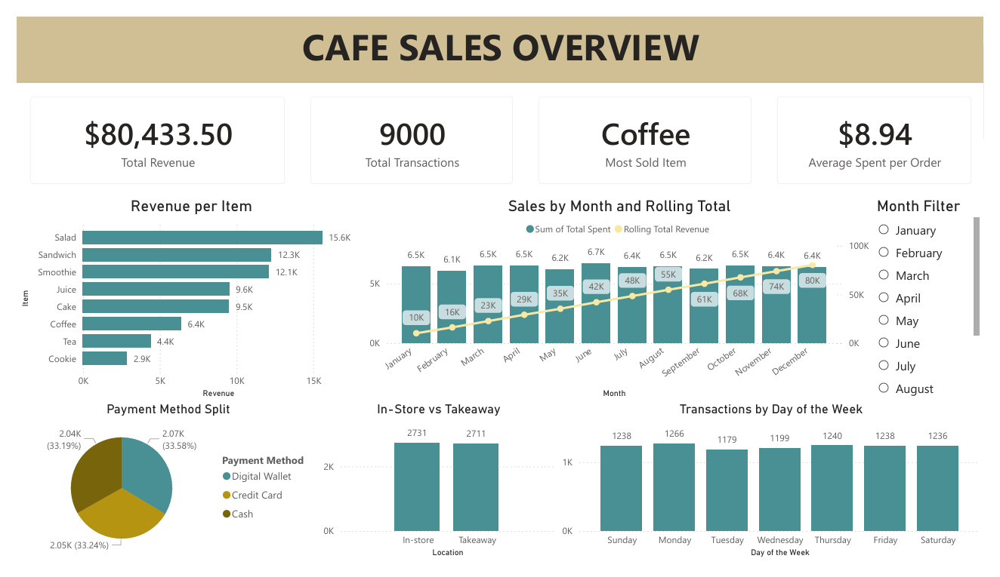

# ☕ Café Sales Data Analysis Project
### Tools Used: MySQL · Power BI · Power Query

---

## 📋 Project Overview

An end-to-end data analysis project using a synthetic café sales dataset from Kaggle. The dataset was intentionally dirty to simulate a realistic data cleaning scenario. The project covers the full pipeline — from raw dirty data, through SQL cleaning and EDA, to a business-ready Power BI dashboard.

**Dataset Source:** [Café Sales Dirty Data – Kaggle](https://www.kaggle.com/datasets/ahmedmohamed2003/cafe-sales-dirty-data-for-cleaning-training)

---

## 🔑 Key Findings

- **Total Revenue:** $80,433.50 across the full year of 2023
- **Total Transactions:** 9,000 orders processed
- **Best Selling Item:** Coffee — 3,212 total units sold
- **Lowest Selling Item:** Cookie — 2,898 total units sold and lowest revenue due to its $1 price point
- **Highest Revenue Item:** Salad — $15,600 total revenue despite not being the top seller, driven by its $5 price point
- **Average Spend per Order:** $8.94 — well above the max single item price of $5, meaning customers consistently buy multiple items per order
- **Payment Methods:** Nearly equal three-way split (~33% each) across Cash, Credit Card, and Digital Wallet — all methods are actively used
- **POS System Issue:** Unknown/blank/error location entries outnumber both In-store (2,731) and Takeaway (2,711) valid records — strong indicator of a bug or recording failure in the café's Point of Sale system
- **Steady Revenue:** Each month generates at least $6,000 but never exceeded $7,000 — potentially higher if NULL transaction dates had been properly recorded in the POS
- **Steady Growth:** Rolling total climbs consistently with no dips, reaching $80K by year end

---

## 🛠️ Project Steps

### 1. Data Cleaning (MySQL)

- Created a **staging table** (`cafe_staging`) copied from the raw dataset to preserve the original data
- **Checked for duplicates** on `Transaction ID` — confirmed zero duplicate records
- **Item column:** Found 304 existing `'UNKNOWN'` rows and 293 blank rows — standardized all blanks to `'UNKNOWN'`
- **Payment Method column:** Found 2,310 `'UNKNOWN'` rows — standardized all blanks to `'UNKNOWN'`
- **Location column:** Standardized all blank entries to `'UNKNOWN'`
- **Recomputed missing `Total Spent`** using `Quantity × Price Per Unit` for rows where value was `'ERROR'`, `'UNKNOWN'`, or blank
- **Fixed a `DOUBLE` vs `INT` conversion bug** — after modifying the `Total Spent` column type, items priced at $1.50 were incorrectly truncated to integers; ran a follow-up `UPDATE` to recompute those rows correctly
- **Recovered accidentally nulled dates** by rejoining `cafe_staging` back to `dirty_cafe_sales` on `Transaction ID`, then properly set actual `'ERROR'` and `'UNKNOWN'` date strings to `NULL`
- **Converted column types:** `Total Spent` → `DOUBLE`, `Transaction Date` → `DATE`
- **Removed low-value rows** where Item, Location, Transaction Date, and Payment Method were all unknown/error/blank simultaneously — these provided zero analytical value
- Created the final **`cleaned_cafe_sales`** table from the cleaned staging data

### 2. Exploratory Data Analysis (MySQL)

Four business questions answered using SQL queries:

- **Date range:** Confirmed dataset covers the full year of 2023 using `MIN()` and `MAX()` on Transaction Date
- **Monthly revenue + rolling total:** Used a CTE with `LAG()` and `SUM() OVER()` window functions to calculate monthly revenue, month-over-month difference, and cumulative rolling total — NULL-dated transactions intentionally included since the revenue still occurred even without a recorded date
- **Best seller analysis:** Grouped by Item and Price Per Unit to compare total units sold and total revenue — `'UNKNOWN'` and `'ERROR'` items excluded for accuracy; Coffee leads in volume (3,212 units), Salad leads in revenue ($15,600), Cookie is the lowest in both units (2,898) and revenue
- **Location analysis:** Counted transactions and summed revenue by Location — flagged that unknown/error entries exceed both In-store and Takeaway counts, pointing to a POS recording issue; In-store and Takeaway are closely matched, showing the café serves both equally

### 3. Dashboard (Power BI)

Built an interactive dashboard using the cleaned dataset with:
- KPI cards: Total Revenue, Total Transactions, Most Sold Item, Average Spent per Order
- Revenue per Item (horizontal bar chart)
- Sales by Month and Rolling Total (combo chart)
- Payment Method Split (pie chart)
- In-Store vs Takeaway comparison (bar chart)
- Transactions by Day of the Week (bar chart)
- **Month Filter** slicer for dynamic month-by-month exploration

---

## 📁 Files in this Repository

| File | Description |
|------|-------------|
| `Data Cleaning.sql` | MySQL script managing table configurations, cleansing routines, and data transformations |
| `EDA_cafe.sql` | Master SQL query script housing exploratory intelligence questions and rolling totals |
| `cafe_sales_cleaned.csv` | Cleaned production-ready output file generated after running SQL transformations |
| `CAFE DASHBOARD.pbix` | Main Power BI workbook file containing data models, canvas reports, and active visuals |
| `Balagtas, Niel_Cafe Sales Documentation.pdf` | Detailed engineering write-up documenting methodology, architecture, and complete project breakdowns |
| `cafe-dashboard-screenshot.png` | Main interface screen capture focusing on the operational overview metrics |

---

## 📊 Dashboard Preview

---

## 💡 Conclusions

The café is in a healthy and stable state based on 2023 data — consistent monthly revenue with no losing months, a steadily climbing rolling total, and a well-balanced payment method distribution. The $8.94 average spend per order signals strong multi-item purchasing behavior, presenting an opportunity to push the average toward $10 through promotions or combo deals.

Although Coffee dominates in units sold, Salad is the real revenue driver at $5 per unit — the café could leverage this by promoting salad pairings or combo meals.

The most critical operational issue flagged is the POS system anomaly: unknown and unrecorded location entries exceed properly recorded In-store and Takeaway transactions. This is likely a system bug or a staff input failure and should be investigated to improve data quality for future reporting.

> **Note:** This is a synthetic dataset used for portfolio and practice purposes. The analytical approach mirrors how I would treat real-world business data.

---

## 👤 Author

**Niel Andrei Balagtas**
- 📧 nielandreibalagtas@gmail.com
- 💼 [LinkedIn](https://www.linkedin.com/in/niel-andrei-balagtas-360442379/)
- 🐙 [GitHub](https://github.com/nielandreibalagtas)

---
